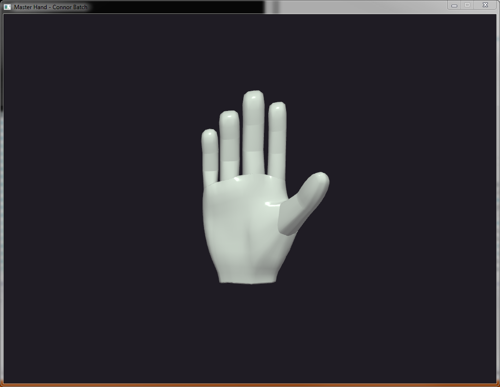
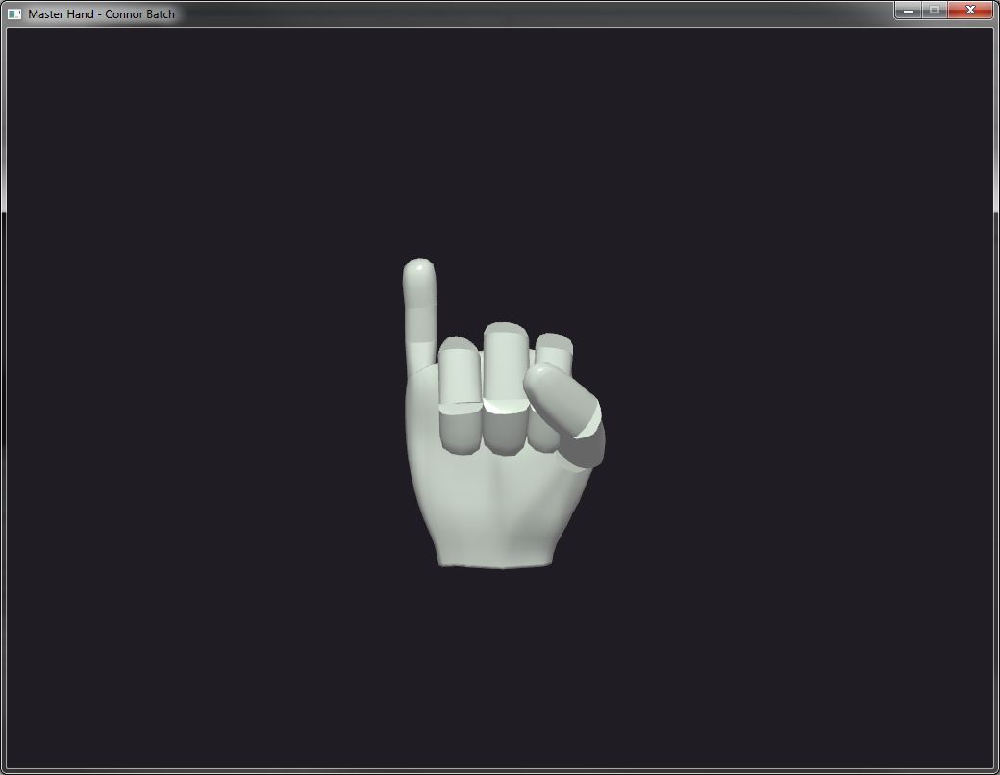
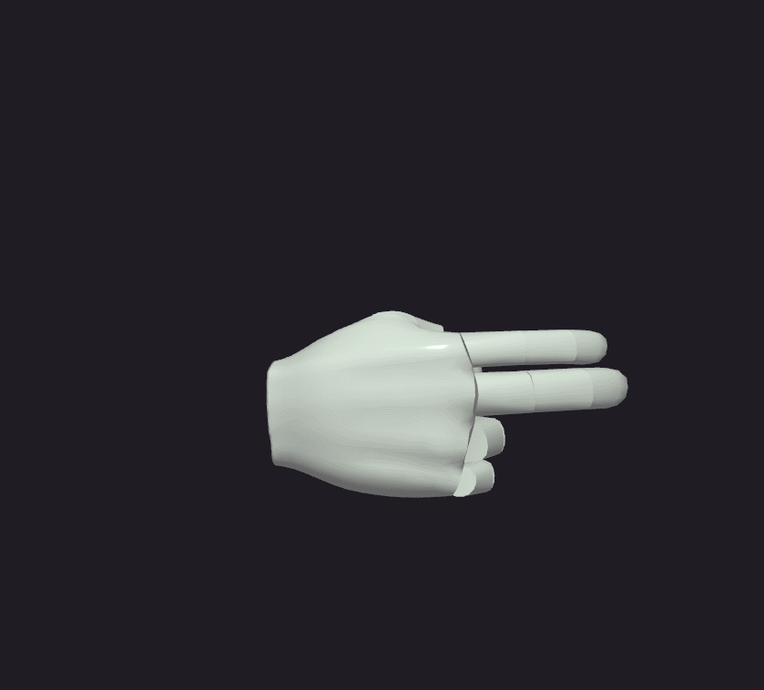

# Fingerspelling Hand
Connor Batch - CPE 471 - Winter 2015 - Zoe Wood</h4>

## Project Description
This project entails a modeled hand capable of fingerspelling, specifically in American Sign Language (ASL). Every alphabetic key has been modeled, including double letters which can be accomplished through a sliding motion in ASL, and the letters which are modeled through a motion rather than simply a hand position (J and Z).

## How it Works

### What is a hand position?
There are several ways that a hand position could be modeled, similarly to how a human hand works, I decided that a hand could solely be modeled as a series of joint rotations. Each letter now can now be created through modifying the same underlying model, but providing different rotational values.

the letter I

## The Buffer
As the user types, the keys they enter are being pushed into a queue that will constantly be updating on the screen as long as the queue isn&#39;t empty. This allows the user to type out a full sentence and the hand will not jump between signs, it will spell them out in the order that they typed in.

## Motion
Movement occurs when there is another item ready to be signed in the queue. The current hand position becomes the new starting position and the destination is the next letter to be signed. The current hand position is then updated between the two positions until it arrives at the destination.

The speed in which the hand is fingerspelling is variable and can be modified with the UP and DOWN arrow keys.

### See it in Action
A demonstration of how movement is modeled through the progression throughout the entire alphabet is shown below.

<em>ASL alphabet</em>

There are two special cases to make note of and both are covered with the following demonstration of "hello world". First is spaces - a space is used deliminate between words, which is characterized in ASL with a pause on the last letter. The second is a double-letter, this is accomplished in ASL with a slide. Both have been accounted for and are available to be witnessed below.

<em>"hello world"</em>
